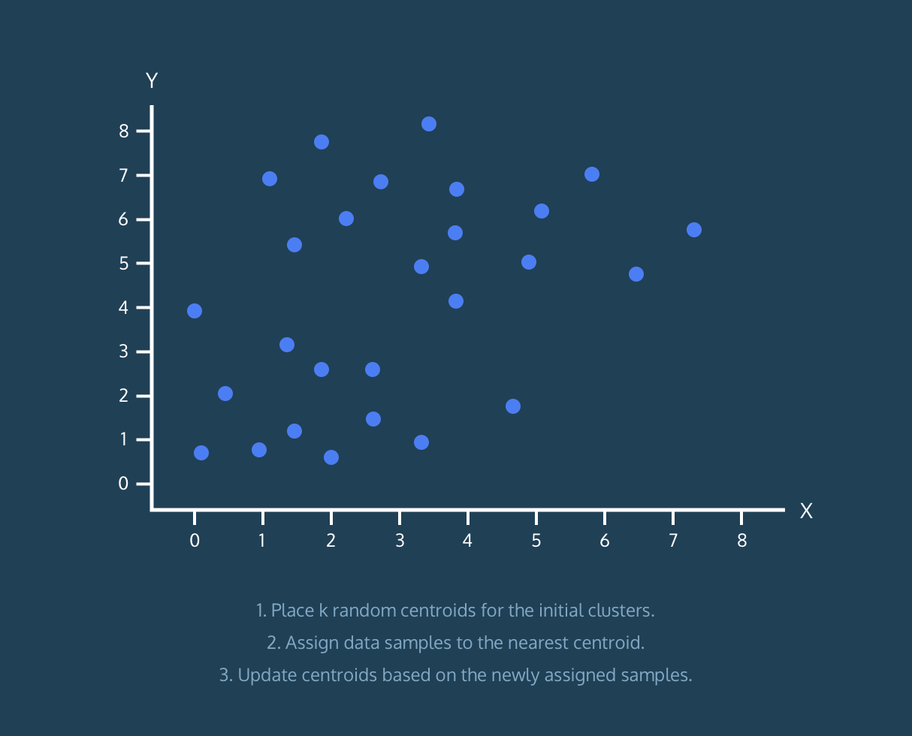
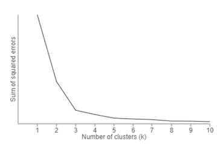

<b><i>
# ***K-means Clustering Algorithm and its Real use case in the Security Domain***

> ## *First lets understand, what is Unsupervised Learning ?*

* Unsupervised learning is the training of a machine using information that is neither classified nor labeled and allowing the algorithm to act on that information without guidance. Here actually the task of the machine is to group unsorted information according to similarities, patterns, and differences without any prior training of data.

* Algormthims involved in unsupervised learning helps in discovery of  hidden patterns or data groupings without the need for human intervention. Its ability to discover similarities and differences in information make it the ideal solution for exploratory data analysis, cross-selling strategies, customer segmentation, and image recognition.

>### Unsupervised learning is classified into two categories of algorithms:  
#### ⭐ Clustering  
#### ⭐ Association  
 

> ### What's is Clustering ?

* Clustering is a data mining technique which groups unlabeled data based on their similarities or differences.
* Clustering algorithms are used to process raw, unclassified data objects into groups represented by structures or patterns in the information.
* There are many algorithms developed to implement the Clustering technique but for this blog lets stick to K-means clustering algorithm

>## K-means Clustering Algorithm

In the K-means clustering algorithm data points are assigned into K groups, where K represents the number of clusters based on the distance from each group’s centroid. The data points closest to a given centroid will be clustered under the same category. A larger K value will be indicative of smaller groupings with more granularity whereas a smaller K value will have larger groupings and less granularity. K-means clustering is commonly used in market segmentation, document clustering, image segmentation, and image compression.

> ### Elbow Method

Now in this K-means clustering algorithm one question arises how to decide the value of K One of the methods is called “Elbow” method can be used to decide an optimal number of clusters. Here you would run K-mean clustering on a range of K values and plot the “percentage of variance explained” on the Y-axis and “K” on X-axis.

In the picture above we can see that as we add more clusters after 3 it doesn't give much better modeling on the data. The first cluster adds much information, but at some point, the marginal gain will start dropping.

> #### Now Lets Study the real world use cases of K-means Cluster

1. ***Identifying crime localities***  
With data related to crimes available in specific localities in a city, the category of crime, the area of the crime, and the association between the two can give quality insight into crime-prone areas within a city or a locality.

2. ***Insurance fraud detection***  
Machine learning has a critical role to play in fraud detection and has numerous applications in automobile, healthcare, and insurance fraud detection. utilizing past historical data on fraudulent claims, it is possible to isolate new claims based on its proximity to clusters that indicate fraudulent patterns. since insurance fraud can potentially have a multi-million dollar impact on a company, the ability to detect frauds is crucial.

3. ***Cyber-profiling criminals***  
Cyber-profiling is the process of collecting data from individuals and groups to identify significant co-relations. the idea of cyber profiling is derived from criminal profiles, which provide information on the investigation division to classify the types of criminals who were at the crime scene.

4. ***Automatic clustering of it alerts***  
Large enterprise it infrastructure technology components such as network, storage, or database generate large volumes of alert messages. because alert messages potentially point to operational issues, they must be manually screened for prioritization for downstream processes. clustering of data can provide insight into categories of alerts and mean time to repair, and help in failure predictions.

## ***Conclusion***
Using the Algorithm we can solve many of the real world use cases like for this for more security purpose, analysis, business needs, verifications, etc.

## ***Thankyou For Reading***

Any query and suggestion are always welcome- [Gaurav Pagare](https://www.linkedin.com/in/gaurav-pagare-8b721a193/)

### Refrences:
1. [link1](https://dzone.com/articles/10-interesting-use-cases-for-the-k-means-algorithm)

2. [link2](https://www.ibm.com/cloud/learn/unsupervised-learning)
